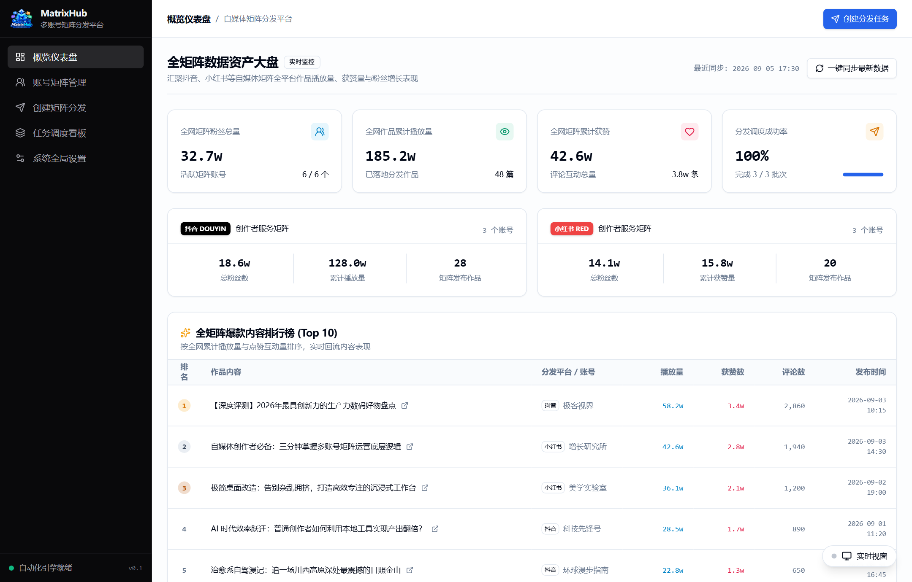
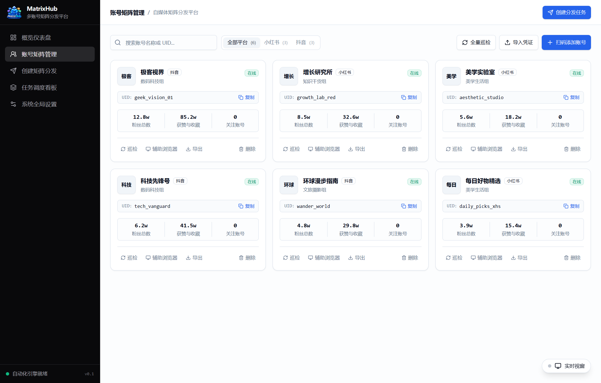
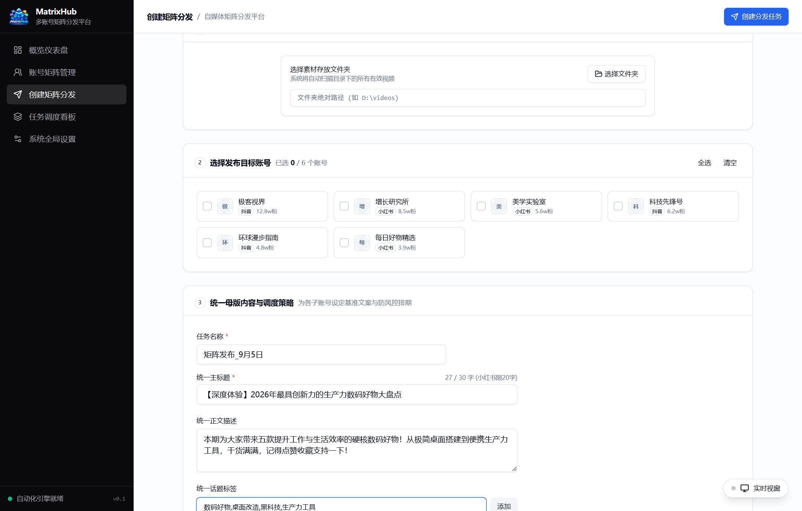
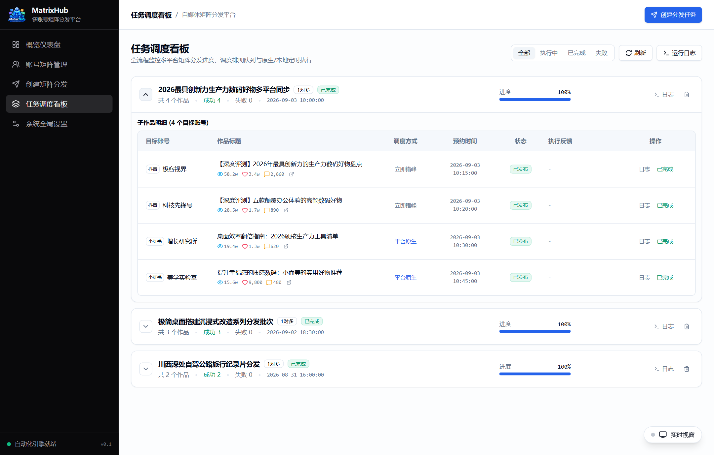
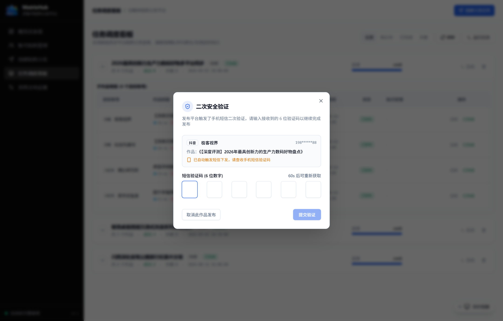
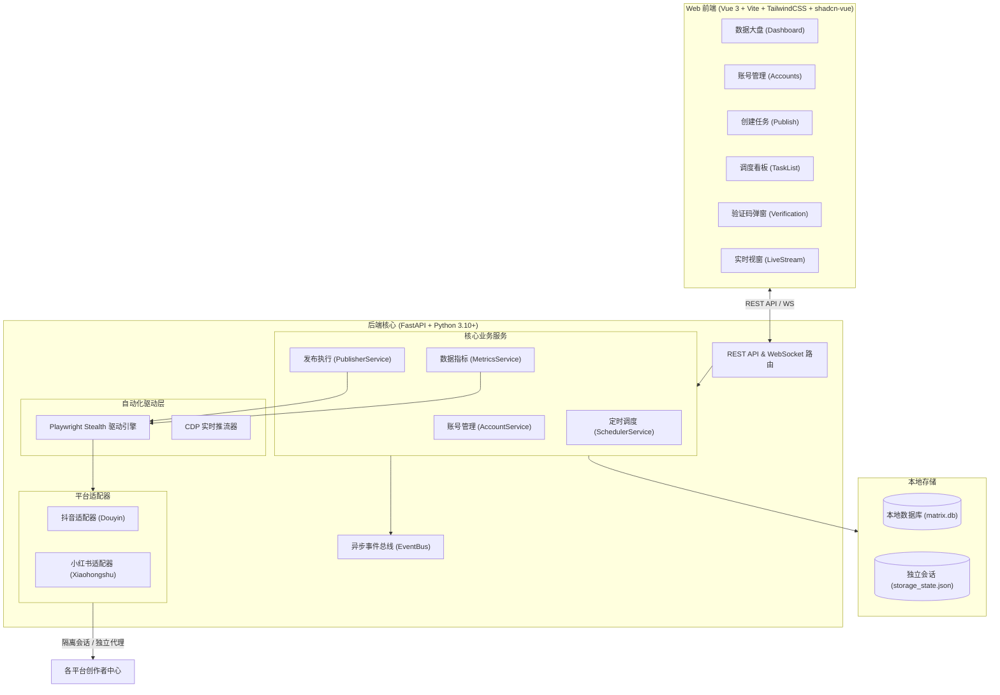

<div align="center">


# MatrixHub

**本地私有化自媒体多账号矩阵分发与数据管理系统**

支持抖音、小红书等多平台自动化分发。所有 Cookie、会话凭证与素材均保存在本地，支持多账号环境隔离、端内短信验证码接管、定时错峰排期与全矩阵数据监控。

[](LICENSE)
[](https://www.python.org/)
[](https://fastapi.tiangolo.com/)
[](https://vuejs.org/)
[](https://playwright.dev/)

[功能特性](#-功能特性) • [平台支持](#-平台支持) • [界面预览](#-界面预览) • [系统架构](#-系统架构) • [快速上手](#-快速上手) • [防风控实践](#-防风控实践) • [路线图](#-路线图)

</div>

---

## ✨ 功能特性

### 1. 账号沙箱隔离与防串号
- **独立会话环境**：基于 Playwright 独立上下文（BrowserContext），每个账号独享独立的 StorageState、Cookies 与硬件指纹，会话完全隔离。
- **独立代理 IP**：支持为每个账号单独绑定 HTTP/SOCKS5 代理节点，实现网络层隔离。
- **本地凭证安全**：所有登录态保存在本地 SQLite 和会话文件中，不经任何第三方云端服务器，原画质直发。

### 2. 多平台矩阵分发
- **灵活分发模式**：支持单素材多账号分发（1:N）与多素材多账号分发（N:N），支持批量扫描本地目录。
- **官方话题标签自动转换**：
  - 抖音：自动触发输入联想，转为平台官方 `#话题` 实体。
  - 小红书：自动转换为平台标准 `#话题#` 实体标签。
- **多模式排期发布**：
  - 平台原生定时：直接调用创作者中心官方预约发布接口。
  - 本地错峰排期：基于 APScheduler 调度引擎，支持配置账号间错峰间隔（如 5~15 分钟），避免并发过高触发风控。

### 3. 端内人机协同与异常接管
- **无感扫码登录**：后台自动捕获创作者中心登录二维码，实时推流到 Web 端，App 扫码即完成授权并自动同步昵称与头像。
- **短信验证码端内接管**：平台触发短信验证风控时，自动化引擎自动点击【获取验证码】，Web 端无缝弹出极简 6 位验证码弹窗，填入后自动回传提交，无需切出页面或手动接管无头浏览器。
- **实时 CDP 视窗推流**：内置基于 Chrome DevTools Protocol 的画中画推流视窗，可随时在网页端查看后台操作进度；遇复杂滑块时可一键拉起本地可见窗口人工协同。

### 4. 全矩阵数据资产监控
- **双维度数据采集**：同步采集账号总粉丝量/总获赞量，以及单篇作品的播放量、点赞数、评论数、收藏数。
- **数据大盘与爆款榜**：提供全网粉丝汇总、各平台数据分布，以及 Top 10 爆款作品排行榜。
- **任务看板数据胶囊**：调度看板中展开已发布作品，即可直接查看播放/获赞/评论数据，并支持直达平台原站。

---

## 🌐 平台支持

| 平台 | 视频分发 | 话题自动转换 | 短信二次验证 | 数据统计回流 | 适配状态 |
| :--- | :---: | :---: | :---: | :---: | :---: |
| **抖音 (Douyin)** | ✅ 支持 | ✅ 转换为 `#话题` 实体 | ✅ 自动发码与端内输入 | ✅ 播放/赞/评/转/藏 | 稳定 |
| **小红书 (RED)** | ✅ 支持 | ✅ 转换为 `#话题#` 实体 | ✅ 自动检测提示 | ✅ 观看/赞/评/藏 | 稳定 |
| **快手 (Kuaishou)** | 🔄 预留 | 规划中 | - | 规划中 | 规划中 |
| **微信视频号** | 🔄 预留 | 规划中 | - | 规划中 | 规划中 |
| **哔哩哔哩 (Bilibili)** | 🔄 规划中 | 规划中 | - | 规划中 | 规划中 |

---

## 📸 界面预览

### 数据资产大盘
展示全网矩阵账号总粉丝、总播放、各平台数据占比及 Top 10 爆款排行榜：


### 账号矩阵管理 & 创建分发任务
| 账号矩阵多维管理 | 一键矩阵分发与排期配置 |
| :---: | :---: |
|  |  |

### 任务调度看板 & 端内短信二次验证
| 调度看板（展开子作品及实时数据胶囊） | 端内短信验证码极简输入弹窗 |
| :---: | :---: |
|  |  |

---

## 🏗️ 系统架构



---

## 🚀 快速上手

### 环境要求
- **Python**：3.10+
- **Node.js**：18.0+ 与 `pnpm`（仅二次开发或编译前端时需要）
- **操作系统**：Windows 10/11、macOS、Linux

### 方式一：Windows 一键启动（推荐）

双击根目录下的 **`start.bat`** 即可。脚本会自动检查并配置 Python 虚拟环境、安装依赖、编译前端并启动服务，随后自动打开浏览器访问：
```text
http://127.0.0.1:8000
```

### 方式二：手动部署运行

#### 1. 启动后端
```bash
# 创建并激活虚拟环境
python -m venv .venv

# Windows:
.venv\Scripts\activate
# macOS/Linux:
# source .venv/bin/activate

# 安装 Python 依赖及浏览器内核
pip install -r backend/requirements.txt
playwright install chromium

# 启动后端服务
python backend/run.py
```

#### 2. 编译或运行前端
```bash
cd frontend
pnpm install

# 本地开发模式（支持热重载）
pnpm run dev

# 或编译静态资源供后端 FastAPI 统一托管
pnpm run build
```

---

## 🔒 防风控实践

在多账号矩阵运营过程中，建议遵循以下实用规范：

1. **发布错峰**：向多个账号分发同一批作品时，建议设置 5~15 分钟的错峰间隔，避免同一 IP 下瞬时并发过高。
2. **独立代理配置**：纳管账号数量较多时，可在【账号管理】中为不同账号配置独立的住宅代理 IP（支持 HTTP / SOCKS5）。
3. **内容微差异**：分发到不同账号时，尽量使用不同的标题、文案或不同的话题标签组合。
4. **单机并发限制**：单台设备建议同时执行的任务并发数控制在 2~3 个以内，可在【系统设置】中调节。

---

## 🗺️ 路线图

- [x] **v0.1**: 基础架构搭建、多账号会话隔离、抖音/小红书自动化发布适配
- [x] **v0.2**: 抖音二次短信验证码端内自动发码与填码闭环、CDP 实时推流视窗
- [x] **v0.3**: 全矩阵数据资产监控大盘、单篇作品播放/互动指标回流与爆款榜单
- [ ] **v0.4**: 小红书多图图文笔记自动化发布支持
- [ ] **v0.5**: 视频指纹智能消重与轻量去重（抽帧微调、元数据与 MD5 调整）
- [ ] **v0.6**: AI 文案批量差异化生成（接入本地 Ollama / 大模型生成多版本标题与文案）
- [ ] **v0.7**: 快手与微信视频号自动化发布与数据回流

---

## 📄 开源协议

本项目基于 [MIT License](LICENSE) 协议开源。请使用者在法律法规及各平台服务条款允许的范围内合理合规使用。
