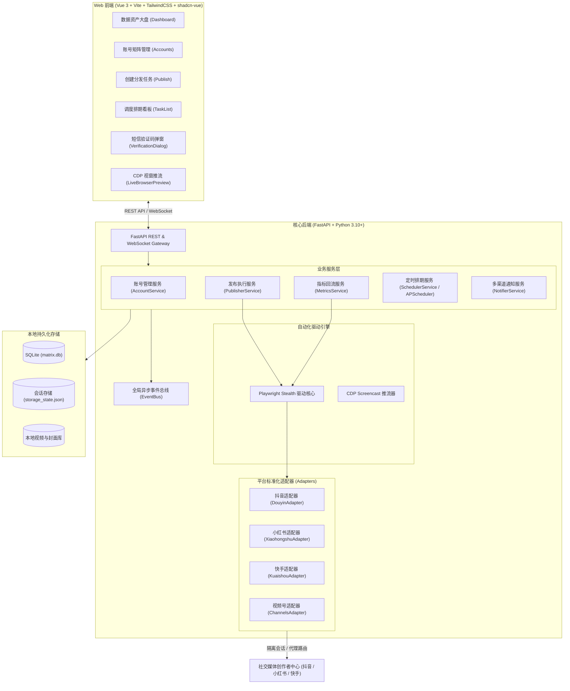

<div align="center">


# MatrixHub (自媒体多账号矩阵分发平台)

**专为自媒体创作者、MCN 机构与矩阵运营团队打造的本地私有化、全自动化多平台矩阵分发与数据资产监控系统。**

[](LICENSE)
[](https://www.python.org/)
[](https://fastapi.tiangolo.com/)
[](https://vuejs.org/)
[](https://playwright.dev/)
[](https://shadcn-vue.com/)
[](https://github.com/)

[功能特性](#-核心特性) • [平台支持](#-平台适配矩阵) • [快速开始](#-快速上手) • [系统架构](#-系统技术架构) • [操作指南](#-核心功能详解) • [防风控指南](#-矩阵安全与防风控实践) • [路线图](#-开发路线图)

</div>

---

## 📖 项目背景与愿景

在当下自媒体矩阵运营中，创作者与运营团队普遍面临以下三大困境：
1. **机械重复**：同一个视频需要逐个打开数十个网页，手动上传、填写标题、选择封面、添加标签，耗费大量时间。
2. **串号与风控封禁**：使用同一浏览器多开切换账号，Cookie 与浏览器指纹严重交叉污染，极易被平台判定为营销号并集体降权甚至封号。
3. **第三方 SaaS 数据与隐私泄露**：市面上的矩阵分发云平台不仅费用高昂，还需要交出账号敏感凭证与 Session，面临盗号和作品画质被二次有损压缩的风险。

**MatrixHub 为彻底解决上述痛点而生：**
- **100% 本地私有化运行**：数据保存在本地 SQLite 数据库中，账号凭证与 Cookie 绝不上云，原片原画质无损直发。
- **Playwright Stealth 底层沙箱隔离**：每个账号独享独立的 Chromium Context、StorageState 与硬件指纹环境，支持独立代理 IP，物理级隔绝串号风险。
- **端内自动化协同闭环**：首创 Web 端内扫码登录推流、短信二次验证码自动点击发码与自动填码闭环、实时浏览器镜像辅助。
- **全矩阵数据资产监控**：自动回流各平台已发布作品的**播放量、点赞数、评论数、收藏数**，提供全网大盘概览与爆款 Top 10 排行榜。

---

## ✨ 核心特性

### 🛡️ 沙箱环境隔离 & 防串号防风控
- **独立上下文沙箱**：每个账号绑定专属的隔离目录与 `storage_state.json`，会话数据互不干扰。
- **独立代理 IP 路由**：支持为单个账号配置独立的 HTTP/SOCKS5 代理节点，实现 IP 级别的纯净隔离。
- **原生画质直发**：彻底告别第三方云平台的二次压制与模糊转码，直接调用创作者中心官方上传管道分发无损原片。

### 🤖 智能人机协同 & 端内二次验证闭环
- **无感扫码授权**：登录时系统拉起无头浏览器捕获创作者中心二维码，实时 Base64 推流至前端，App 扫码即刻完成授权入库与自动持久化。
- **短信验证码自动闭环**：平台触发“接收短信验证码”安全弹窗时，后端 Playwright 自动捕获并**自动点击【获取验证码】**，Web 前端无缝弹出极简 6 位验证码输入框，输入后自动回填提交，无需切出页面。
- **CDP 视窗实时推流**：基于 Chrome DevTools Protocol Screencast 协议，支持在 Web 端以画中画视窗实时查看后台自动化操作；遇复杂滑块时可一键拉起本地可见窗口人工协同。

### 📊 全矩阵数据资产大盘 & 爆款内容监控
- **双维度数据采集**：账号总粉丝/总赞 + 单篇作品独立播放量、获赞量、评论量、收藏量。
- **响应拦截 + DOM 双兜底机制**：无头浏览器自动拦截创作者中心内部接口 JSON 数据，并辅以 DOM 解析双重兜底，防封且免逆向维护复杂的加密签名。
- **全景数据中心仪表盘**：全网矩阵粉丝总量、全网总播放量、总获赞量走势、各平台资产占比分布与 **Top 10 爆款内容排行榜**。
- **任务看板数据小胶囊**：任务调度看板中直接在已发布作品下方内嵌 `👁️ 播放量`、`❤️ 获赞数`、`💬 评论数` 与原站跳转链接。

### ⏱️ 高可用错峰排期调度
- **双重定时发布机制**：
  - **平台官方原生定时**：调用创作者平台内置的预约公开功能（平台官方托管倒计时）。
  - **本地错峰排期调度**：基于 APScheduler 引擎，支持设置账号间随机错峰间隔（如 5±1 分钟递增），模拟真人发布节奏。
- **失败重试与健康巡检**：支持子任务单独重试、状态流转告警（Webhook 推送飞书/企业微信/钉钉）与账号健康心跳巡检。

### ⚡ 零门槛部署 & 极简现代设计
- **零外部重量级依赖**：无需安装 Redis、无需安装 MySQL、无需 Docker，单进程极速拉起。
- **Windows 一键批处理**：内置 `start.bat`，双击自动检查虚拟环境、构建产物并打开浏览器。
- **纯净界面交互**：完全遵循官方 [shadcn-vue](https://shadcn-vue.com/) 规范，提供纯粹、克制、无多余 AI 味的桌面级 WebUI 体验。

---

## 🌐 平台适配矩阵

| 平台 | 视频分发 | 图文笔记 | 官方话题实体转换 | 扫码授权直登 | 短信二次验证闭环 | 播放/互动数据回流 | 适配状态 |
| :--- | :---: | :---: | :---: | :---: | :---: | :---: | :---: |
| **抖音 (Douyin)** | ✅ 支持 | 规划中 | ✅ 自动转换为 `#话题` 节点 | ✅ 支持 | ✅ 自动发码与自动填码 | ✅ 播放/赞/评/转/藏 | 🟢 深度稳定 |
| **小红书 (RED)** | ✅ 支持 | 规划中 | ✅ 自动转换为 `#话题#` 实体 | ✅ 支持 | ✅ 自动识别处理 | ✅ 观看/赞/评/藏 | 🟢 深度稳定 |
| **快手 (Kuaishou)** | 🔄 骨架预留 | - | 🔄 规划中 | 🔄 规划中 | - | 🔄 规划中 | 🟡 架构就绪 |
| **微信视频号 (Channels)** | 🔄 骨架预留 | - | 🔄 规划中 | 🔄 规划中 | - | 🔄 规划中 | 🟡 架构就绪 |
| **哔哩哔哩 (Bilibili)** | 🔄 规划中 | - | 🔄 规划中 | 🔄 规划中 | - | 🔄 规划中 | ⚪ 筹备中 |

---

## 🏗️ 系统技术架构



---

## 🚀 快速上手

### 环境要求
- **操作系统**：Windows 10/11、macOS 或 Linux
- **Python**：3.10 或更高版本
- **Node.js**：18.0 或更高版本（搭配 `pnpm`）
- **现代浏览器**：Google Chrome 或 Microsoft Edge

---

### 方式一：Windows 一键启动（推荐创作者）

1. 克隆或下载本仓库至本地目录：
   ```bash
   git clone https://github.com/clueing/matrix-hub.git
   cd matrix-hub
   ```
2. 双击运行根目录下的 **`start.bat`**。
3. 脚本将自动完成：
   - 创建并激活 Python 虚拟环境（`.venv`）
   - 安装 Python 依赖与 Playwright 浏览器内核
   - 自动构建前端静态页面
   - 自动在默认浏览器中打开控制台：**`http://127.0.0.1:8000`**

---

### 方式二：开发者手动启动

#### 1. 后端服务启动
```bash
# 1. 创建虚拟环境并激活
python -m venv .venv
# Windows:
.venv\Scripts\activate
# macOS/Linux:
# source .venv/bin/activate

# 2. 安装依赖并下载 Playwright 浏览器
pip install -r backend/requirements.txt
playwright install chromium

# 3. 运行后端服务
python backend/run.py
```

#### 2. 前端服务启动（开发模式）
```bash
cd frontend
pnpm install
pnpm run dev
```
访问开发前端地址：`http://localhost:5173`。

若需打包为生产静态产物交由 FastAPI 统一托管：
```bash
pnpm run build
```

---

## 🖥️ 核心功能详解

### 1. 账号矩阵接入与会话生命周期
- 进入【账号矩阵管理】，点击【添加账号】选择平台（如抖音或小红书）。
- 系统在后台唤起环境并获取官方登录二维码，实时在弹窗中显示。使用对应手机 App 扫码确认后，系统自动捕获登录态并提取昵称、UID 与头像。
- 支持一键导出/导入账号凭证包（ZIP 格式），方便在多台设备间快速迁移。
- 提供【巡检同步】按钮，秒级检测 Cookie 有效性并同步最新状态。

### 2. 创建分发任务与标签转换
- 支持**单视频分发多账号（1:N）** 或 **多视频对应多账号（N:N）**。
- 支持直接选取本地视频文件，或扫描整个视频文件夹批量入库。
- **智能话题标签转换**：输入 `#搞笑 #生活`，系统在抖音平台会自动通过键入唤起并点击官方话题联想列表转换实体；在小红书平台会自动转换为 `#话题#` 官方有效链接。
- 支持指定定时发布时间或设置每个账号之间的阶梯错峰间隔。

### 3. 实时浏览器视窗与端内二次验证闭环
- **实时视窗**：发布过程中，点击右下角浮动的小窗图标可实时查看无头浏览器正在执行的动作与页面渲染，透明可控。
- **自动短信填码**：当抖音触发手机短信验证时，后台日志提示发码，系统自动向绑定手机发送短信；Web 端弹出输入框，输入 6 位验证码后即可自动推进完成发布。

### 4. 全矩阵数据大盘与爆款排行榜
- 首页仪表盘汇总全网矩阵总粉丝量、总播放量、总获赞量。
- 点击【一键同步最新数据】或等待每日凌晨 03:30 系统自动巡检，最新数据自动回流更新。
- 提供 **Top 10 爆款作品排行榜**，随时掌握表现最佳的内容。
- 任务列表中已发布的作品直接内嵌数据胶囊，支持直达平台原站。

---

## 🔒 矩阵安全与防风控实践

为了确保矩阵账号长期健康运作，建议遵循以下运营规范：

1. **单设备并发控制**：单个物理设备建议同时运行的发布并发任务数不超过 2~3 个，可在【系统设置】中调节。
2. **错峰发布间隔**：同一批次分发到多个账号时，建议设置 5~15 分钟的基础错峰间隔，并启用随机上下扰动，避免同一时刻全网齐发。
3. **独立网络隔离**：对于多账号体量较大的矩阵团队，建议在【账号管理】中为不同账号绑定独立的住宅代理 IP（支持 HTTP / SOCKS5）。
4. **原创度与差异化**：避免完全相同的标题和文案推送到同一平台下的不同账号，建议合理搭配不同的话题标签。

---

## 🗺️ 开发路线图

- [x] **v0.1**: 基础多账号矩阵分发架构、抖音与小红书视频发布自动化适配
- [x] **v0.2**: 抖音二次短信验证码端内无缝自动发码与填码闭环、CDP 实时屏幕推流
- [x] **v0.3**: 全矩阵数据资产监控大盘、播放/点赞/评论数据回流与爆款排行榜
- [ ] **v0.4**: 小红书多图图文笔记发布与图集分发支持
- [ ] **v0.5**: 视频指纹智能消重与去重处理（轻量微剪、MD5、色彩微调）
- [ ] **v0.6**: AI 多版本文案改写引擎（结合本地 Ollama 或云端大模型根据人设一键生成差异化标题）
- [ ] **v0.7**: 快手与微信视频号自动化发布与数据回流适配

---

## 🤝 参与贡献

欢迎任何形式的贡献与建议！
1. **Fork** 本仓库并创建您的专属特性分支 (`git checkout -b feature/AmazingFeature`)。
2. 提交您的修改 (`git commit -m 'feat: Add some AmazingFeature'`)，请遵循规范的 Git 提交消息。
3. 推送分支至您的远程仓库 (`git push origin feature/AmazingFeature`)。
4. 提交 **Pull Request**，我们将第一时间进行 Review 与合并。

---

## 📄 开源协议

本项目基于 [MIT License](LICENSE) 协议开源。创作者与开发者可免费用于个人或商业用途，但请严格遵守各平台服务条款，合理合法合规运营。

---

<div align="center">
  <b>如果 MatrixHub 对您的矩阵运营有所帮助，请为本项目点亮一颗 ⭐️ Star 支持我们持续迭代！</b>
</div>
